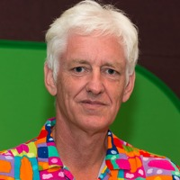
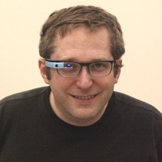
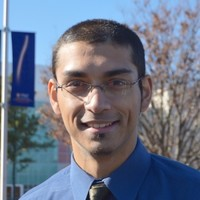
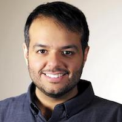
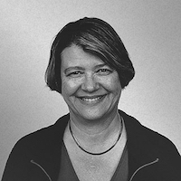

# Artificial Intelligence Nanodegree Instructor Biographies

## Term 1:

#### Peter Norvig - Research Director, Google
Peter Norvig is a Director of Research at Google and is co-author of Artificial Intelligence: A Modern Approach, the leading textbook in the field.  
     

#### Sebastian Thrun - Founder and President, Udacity
As the founder and president of Udacity, Sebastian’s mission is to democratize education. He is also the founder of Google X, where he led projects including the Self-Driving Car, Google Glass, and more.  
   

#### Thad Starner - Professor of Computer Science, Georgia Tech
Thad Starner is the director of the Contextual Computing Group (CCG) at Georgia Tech and is also the longest-serving Technical Lead/Manager on Google's Glass project.  
    

#### Arpan Chakraborty - Instructor, Udacity
Arpan is a computer scientist with a PhD from North Carolina State University. He teaches at Georgia Tech (within the Mas- ters in Computer Science program), and is a coauthor of the book Practical Graph Mining with R.
    

#### David Joyner - Product Lead, Udacity
Eleven-year veteran of Georgia Tech, from undergrad to PhD to now delivering and teaching in the Online Masters of CS program. Passionate about using AI to deliver individualized, scalable educational experiences. Always looking for something new to learn.  
     

#### Dhruv Parthasarathy - AI Director of Learning, Udacity
I lead the Artificial Intelligence, Self-Driving Car, Deep Learning, and Machine Learning Nanodegree programs at Udacity. Nanodegrees are intensive 6-9 month products for learning a given skill set. In my role, I focus on designing the curriculum, ensuring the user experience is fantastic, and that we are metric driven and consistently seeing high retention and student success rates.
   

## Term 2:

#### Mat Leonard - Instructor, Udacity
Mat is a former physicist, research neuroscientist, and data scientist. He did his PhD and Postdoctoral Fellowship at the University of California, Berkeley.
  

#### Luis Serrano - Instructor, Udacity
Luis was formerly a Machine Learning Engineer at Google. He holds a PhD in mathematics from the University of Michigan, and a Postdoctoral Fellowship at the University of Quebec at Montreal.
  

#### Jay Alammar - Instructor, Udacity
Jay has a degree in computer science, loves visualizing machine learning concepts, and is the Investment Principal at STV, a $500 million venture capital fund focused on high-technology startups.
  

#### Dana Sheahen - Content Developer, Udacity
Dana is an electrical engineer with a Masters in Computer Science from Georgia Tech. Her work experience includes software development for embedded systems in the Automotive Group at Motorola, where she was awarded a patent for an onboard operating system.
  
