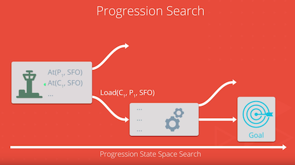
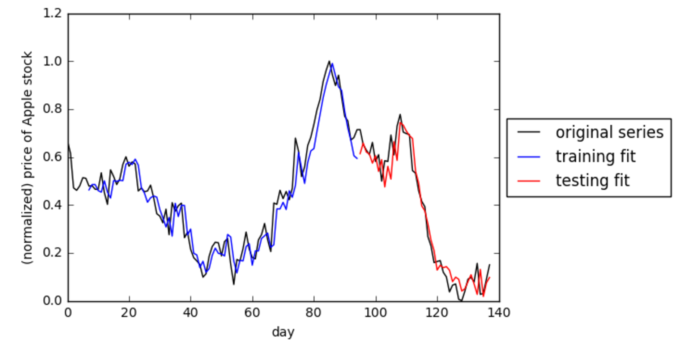
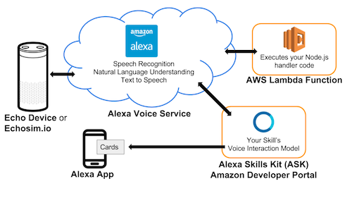

# Artificial Intelligence Nanodegree
**Inaugural offering of AI Nanodegree program**

Instructors: 
- **Term 1:** Peter Norvig, Sebastian Thrun, Thad Starner, Arpan Chakraborty, David Joyner, and Dhruv Parthasarathy.
- **Term 2:** Mat Leonard, Luis Serrano, Jay Alammar, and Dana Sheahen. 
- For biographical information, see [BIO.md][1]  

Offered By: [udacity.com][2]

## Introduction
This repo contains projects, mini projects, and labs for the two-term Artificial Intelligence Nanodegree program offered through Udacity. 

This was the very first offering of this program, which has now been split into two Nanodegrees: AI Nanodegree ([nd891][3]) and Deep Learning Nanodegree ([nd101][4]). As well, the three capstone projects have been expanded into two Nanodegrees: Computer Vision Nanodegree ([nd891][5]) and Natural Language Processing Nanodegree ([nd892][6], combining the NLP and VUI concentrations). 

Feel free to use the material for reference purposes or if you get stuck. However, I would encourage you to try to complete all projects and exercises yourself, so that you can maximize your learning and enjoyment of the program.

## Udacity Description
#### About this Nanodegree
**Term 1:**  
*Learn Foundational AI Algorithms.* Learn to write programs using the foundational AI algorithms powering everything from NASA’s Mars Rover to DeepMind’s AlphaGo Zero. You’ll master Beam Search and Random Hill Climbing, Bayes Networks and Hidden Markov Models, and more.

**Term 2:**  
*Build Deep Learning Models Today.* Deep learning is driving advances in artificial intelligence that are changing our world. Enroll now to build and apply your own deep neural networks to challenges like image classification and generation, time-series prediction, and model deployment.

**Term 2: Capstone Projects:**  
*Computer Vision*. Master the computer vision skills behind advances in robotics and automation. Write programs to analyze images, implement feature extraction, and recognize objects using deep learning models.  

*Natural Language Processing and Voice User Interfaces*. Master the skills to get computers to understand, process, and manipulate human language. Build models on real data, and get hands-on experience with sentiment analysis, machine translation, and more.  

#### Overview
**Term 1:**  
This term will teach you how to become a better Artificial Intelligence or Machine Learning Engineer by teaching you classical AI algorithms applied to common problem types. You will complete projects and exercises incorporating search, optimization, planning, and probabilistic graphical models which have been used in Artificial Intelligence applications for automation, logistics, operations research, and more. These concepts form the foundation for many of the most exciting advances in AI in recent years. Each project you build will be an opportunity to demonstrate what you’ve learned in your lessons, and become part of a career portfolio that will demonstrate your mastery of these skills to potential employers.

This term covers classical AI techniques that you will need to master to become a better AI practitioner. Specifically, we will focus on intermediate to advanced programming skills, linear algebra, and algorithms that appear in a variety of AI applications.  

**Term 2:**  
This term offers you a solid introduction to the world of deep learning. In this program, you’ll master fundamentals that will enable you to go further in the field, launch or advance a career, and join the next generation of deep learning talent that will help define a beneficial, new, AI-powered future for our world. You will study cutting-edge topics such as Neural Networks, Convolutional Neural Networks, Recurrent Neural Networks, Generative Adversarial Networks, and Network Deployment, and build projects in PyTorch and NumPy. You’ll learn from authorities such Ian Goodfellow and Jun-Yan
Zhu, inventors of types of generative adversarial networks, as well as AI experts, Sebastian Thrun and Andrew Trask. For anyone interested in this transformational technology, this program is an ideal point-of-entry.

The term is comprised of 4 projects. Each project you build will be an opportunity to prove your skills and demonstrate what you’ve learned in your lessons.

## Topics Covered
**Term 1: Artificial Intelligence:**  
Game Playing, Search, Simulated Annealing, Constraint Satisfaction, Logic and Reasoning, Planning Search, Probability, and Hidden Markov Models(HMMs).

**Term 2: Deep Learning:**  
Deep Neural Networks, Convolutional Neural Networks (CNNs), TensorFlow, Autoencoders, Recurrent Neural Networks (RNNs), Long Short-Term Memory Networks (LSTMs), Implementing RNNs and LSTMs, Hyperparameters, Sentiment Prediction with RNNs, Generative Adversarial Networks (GANs), and Semisupervised Learning.

**Term 2: Capstone Projects:**  
Computer Vision (CV) - Image Representation, Image Analysis, Features Recognition, and Object Recognition.
Natural Language Processing (NLP) - Text Processing, Feature Extraction, Modeling, Embeddings and Word2Vec, and Sequence to Sequence.
Voice User Interfaces (VUIs) - Speech Recognition.

For further information on topics and technologies covered, see [TOPICS.md][7].

## Syllabus

### Term 1: Artificial Intelligence

**Lesson 1: Introduction.** 
- Meet the course instructors and Udacity team.
- Learn about the resources available to help you succeed.

**Lesson 2: Setting up with Anaconda.**  
- Install the software and complete necessary system configuration you’ll need for the projects.

**Lesson 3: Solving a Sudoku with AI.** 
- Express logical constraints as Python functions.
- Use constraint propagation & search to solve all Sudoku puzzles.  
- Project: [Build A Sudoku Solver][28]
  - [Udacity Repo: AIND-Sudoku][8]
  - Humans use reason to solve problems by decomposing the problem statement and incorporating domain knowledge to limit the possible solution space. In this project you’ll use a technique called constraint propagation together with backtracking search to make an agent that only considers reasonable solution candidates and efficiently solves any Sudoku puzzle. This approach appears in many classical AI problems, and the solution techniques have been extended and applied to diverse problems in bioinformatics, logistics, and operations research.
  - In this project you will demonstrate some basic algorithms knowledge, and learn to use constraint satisfaction to solve general problems.

**Lesson 4: Introduction to AI.** 
- Consider the meaning of “artificial intelligence”
- Be able to define core concepts from AI including “agents”, “environments”, and “states”
- Learn the concept of “rational” behavior for AI agents

**Lesson 5: Introduction to Game Playing.** 
- Understand “adversarial” problems & applications (e.g., multi-agent environments).
- Extend state space search techniques to domains your agents do not fully control.
- Learn the minimax search technique.

**Lesson 6: Advanced Game Playing.** 
- Learn techniques used to overcome limitations in basic minimax search like depth-limiting and alpha-beta pruning.
- Extend adversarial search to non-deterministic domains and domains with more than two players.
  
- Project: [Build An Adversarial Game Playing Agent][29]
  - [Udacity Repo: AIND-Isolation][9]
  - Intelligent agents are expected to act in complex domains where their goals and objectives may not be immediately achievable. They must reason about their goals and make rational choices of actions to achieve them. 
  - In this project you will build a system using symbolic logic to represent general problem domains and use classical search to find optimal plans for achieving your agent’s goals. Planning & scheduling systems power modern automation & logistics operations, and aerospace applications like the Hubble telescope & NASA Mars rovers.
  - In this project you will demonstrate an understanding of classical optimization & search algorithms, symbolic logic, and domain-independent planning.

**Lesson 7: Search.** 
- Learn about the significance of search in AI.
- Learn uninformed search techniques including depth-first order, breadth-first order, and Uniform Cost Search.
- Learn informed search techniques (using heuristics) including A*
- Understand admissibility and consistency conditions for heuristics
- Lab: [Pac-Man Search][30]
  - [Berkeley Repo: CS188-PacMan][10]
  - Implement informed & uninformed search for Pacman

**Lesson 8: Simulated Annealing.** 
- Introduce iterative improvement problems that can be solved with optimization.
- Learn Random Hill Climbing for local search optimization problems.
- Learn to use Simulated Annealing for global optimization problems.
- Explore and implement Genetic Algorithms that keep a pool of candidates to solve optimization problems
- Lab: [Simulated Annealing][31]
  - [Udacity Repo: AIND-Simulated_Annealing][11]

**Lesson 9: Constraint Satisfaction.** 
- Learn to represent problems in terms of logical constraints • Use constraint propagation to limit the potential solution space.
- Incorporate backtracking search to find a solution when the set of constraints is incomplete.
- Lab: [Constraint Satisfaction][32]
  - [Udacity Repo: AIND-Constraint_Satisfaction][12]

**Lesson 10: Logic and Reasoning.** 
- Learn Propositional logic (propositions & statements).
- Learn First-Order logic (quantifiers, variables, & objects).
- Encode problems with symbolic constraints using first-order logic.

**Lesson 11: Implement a Planning Search.** 
- Learn to define planning problems
- Learn high-level features of automated planning techniques using search & symbolic logic including forward planning, backwards planning, & hierarchical planning.
- Explore planning heuristics & planning graphs.

  
- Project: [Build A Forward Planning Agent][33]
  - [Udacity Repo: AIND-Planning][13]
  - Intelligent agents are expected to act in complex domains where their goals and objectives may not be immediately achievable. They must reason about their goals and make rational choices of actions to achieve them. 
  - In this project you will build a system using symbolic logic to represent general problem domains and use classical search to find optimal plans for achieving your agent’s goals. Planning & scheduling systems power modern automation & logistics operations, and aerospace applications like the Hubble telescope & NASA Mars rovers.
  - In this project you will demonstrate an understanding of classical optimization & search algorithms, symbolic logic, and domain- independent planning.

**Lesson 12: Probability.** 
- Review key concepts in probability including discrete distributions, joint probabilities, and conditional probabilities.

**Lesson 13: Bayes Nets.** 
- Efficiently encode joint probabilities in Bayes networks.

**Lesson 14: Inference in Bayes Nets.** 
- Learn about inference in Bayes networks through exact enumeration with optimizations.
- Learn techniques for approximate inference in more complex Bayes networks.

**Lesson 15: Build a Sign Language Recognizer.** 
- Learn parameters to maximize the likelihood of model parameters to training data.
- Determine the likelihood of observing test data given a fixed model.
- Learn an algorithm to Identify the most likely sequence of states in a model given some data.
- Learn the dynamic time warping algorithm for time-series analysis.
- Project: [Part Of Speech Tagging][34]
  - [Udacity Repo: AIND-Recognizer][14]
  - Probabilistic models allow your agents to better handle the uncertainty of the real world by explicitly modeling their belief state as a distribution over all possible states. 
  - In this project you’ll use a Hidden Markov Model (HMM) to perform part of speech tagging, a common pre-processing step in Natural Language Processing. HMMs have been used extensively in NLP, speech recognition, bioinformatics, and computer vision tasks.

### Term 2: Deep Learning

**Lesson 1: Welcome.** 

**Lesson 2: Deep Neural Networks.** 
- In this lesson, you will learn solid foundations on deep learning and neural networks. 
- You’ll also implement gradient descent and backpropagation in Python.
- Mat and Luis will introduce you to a different error function and guide you through implementing gradient descent using NumPy matrix multiplication..
- Now that you know what neural networks are, in this lesson, you will learn several techniques to improve their training. Learn how to prevent overfitting of training data and best practices for minimizing the error of a network.
- Mini Project: [Student Admissions in Keras][35]
  - [Udacity Repo: aind2-dl][15]
- Mini Project: [IMDB Data in Keras][35] 
  - [Udacity Repo: aind2-dl][15]
  - In this project, you will define and train a neural networks for sentiment analysis (identifying and categorizing opinions expressed in text).

**Lesson 3: Convolutional Neural Networks.** 
- Take advantage of Amazon’s GPUs to train your neural network faster. In this lesson, you’ll setup an instance on AWS and train a neural network on a GPU.
- Alexis and Cezanne explain how Convolutional Neural Networks can be used to identify patterns in images and how they help us dramatically improve performance in image classification tasks.
- Most people don’t train their own networks on massive datasets. In this lesson, you’ll learn how to finetune and use a pretrained network and apply it to a new task using transfer learning.
- Mini Project: [Training an MLP on MNIST][36]
  - [Udacity Repo: aind2-dl][16]
- Mini Project: [CNNs in Keras][36]
  - [Udacity Repo: aind2-cnn][16]
- Mini Project: [Image Augmentation in Keras][36]
  - [Udacity Repo: aind2-cnn][16]

**Lesson 4: CNN Project: Dog Breed Classifier.** 
- Project: [Dog Breed Classifier][37]
  - [Udacity Repo: dog-project][17]
  - In this project, you will define a Convolutional Neural Network that performs better than the average human when given the task: identifying dog breeds. 
  - Given an image of a dog, your algorithm will produce an estimate of the dog’s breed. 
  - If supplied an image of a human, the code will *also* produce an estimate of the closest- resembling dog breed. 
  - Along with exploring state-of-the-art CNN models for classification, you will make important design decisions about the user experience for your app.

**Lesson 5: Intro to TensorFlow.** 
- Lab: [TensorFlow Neural Network][38] 
  - [Udacity Repo: deep-learning][18]

**Lesson 6: Autoencoders.** 
- Autoencoders are neural networks used for data compression, image denoising, and dimensionality reduction. 

**Lesson 7: Recurrent Neural Networks.** 
- Jeremy will introduce Recurrent Neural Networks (RNNs), which are machine learning models that are able to recognize and act on sequences of inputs.

**Lesson 8: Long Short-Term Memory Networks (LSTM).** 
- Luis explains Long Short-Term Memory Networks (LSTM), and similar architectures that form a memory about a sequence of inputs, over time.

**Lesson 9: Implementing RNNs and LSTMs.** 
- Train recurrent neural networks to generate new characters,words, and bodies of text.

**Lesson 10: Hyperparameters.** 
- In this lesson, we’ll look at a number of different hyperparameters that are important for our deep learning work, such as learning rates. We’ll discuss starting values and intuitions for tuning each hyperparameter.

**Lesson 11: Sentiment Prediction with RNN.** 
- In this lesson, you’ll learn to implement a recurrent neural network for predicting sentiment. This is intended to give you more experience building RNNs.

**Lesson 12: RNN Project: Time Series Prediction and Text Generation.** 

- Project: [Time Series Prediction and Text Generation][39]
  - [Udacity Repo: aind2-rnn][19]

**Lesson 13: Generative Adversarial Networks.** 
- Ian Goodfellow, the inventor of GANs, introduces you to these exciting models. 
- You’ll also implement your own GAN on a simple dataset.

**Lesson 14: Deep Convolutional GANs.** 
- Implement a Deep Convolutional GAN to generate complex, color images of house numbers.

**Lesson 15: Semisupervised Learning.** 

**Lesson 16: Concentration Previews.** 

### Term 2 Capstone Projects:

#### Computer Vision (CV)
**Lesson 1: Introduction to Computer Vision.** 
- Learn where computer vision techniques are used in industry.
- Prepare for the course ahead with a detailed topic overview.
- Start programming your own applications!
- Project: [Mimic Me][40]    
  - [Udacity Repo: AIND-CV-Mimic][20]

**Lesson 2: Image Representation and Analysis.** 
- See how images are represented numerically.
- Implement image processing techniques like color and geometric transforms.
- Program your own convolutional kernel for object edge-detection.

**Lesson 3: Image Segmentation.** 
- Implement k-means clustering to break an image up into parts.
- Find the contours and edges of multiple objects in an image.
- Learn about background subtraction for video.

**Lesson 4: Features and Object Recognition.** 
- Learn why distinguishing features are important in pattern and object recognition tasks.
- Write code to extract information about an object’s color and shape.
- Use features to identify areas on a face and to recognize the shape of a car or pedestrian on a road.

**Lesson 5: CV Capstone: Facial Keypoint Detection and Real-time Filtering.** 

- Capstone Project: [Facial Keypoint Detection][41]
  - [Udacity Repo: AIND-CV-FacialKeypoints][21]
  - Use image processing techniques and deep learning techniques to detect faces in an image and find facial keypoints, such as the position of the eyes, nose, and mouth on a face.
  - This project tests your knowledge of image processing and feature extraction techniques that allow you to programmatically represent different facial features. 
  - You’ll also use your knowledge of deep learning techniques to program a convolutional neural network to recognize facial keypoints. Facial keypoints include points around the eyes, nose, and mouth on any face and are used in many applications, from facial tracking to emotion recognition.

#### Natural Language Processing (NLP)
**Lesson 1: Introduction to Natural Language Processing.** 

**Lesson 2: Project: Bookworm (Optional).** 
- Project: [Bookworm][42]   
  - [Udacity Repo: AIND-NLP-Bookworm][22] 

**Lesson 3: Natural Language Processing.** 
- Learn the main techniques used in natural language processing.
- Get familiarized with the terminology and the topics in the class.
- Build your first application with IBM Watson.

**Lesson 4: Text Processing.** 
- See how text gets processed in order to use it in models. • Learn techniques such as tokenization, stemming, and lemmatization.
- Get started with part of speech tagging and named entity recognition.

**Lesson 5: Feature Extraction.** 
- Learn to extract features from text.
- Learn the most used embedding algorithms, such as Word2Vec and Glove.
- Use the FastText model for word embeddings.

**Lesson 6: Modeling.** 
- Learn about the main uses of deep learning models in NLP. 
- Learn about machine translation, topic models, and sentiment analysis.
- Lab: [Sentiment Analysis][43]  
  - [Udacity Repo: AIND-NLP][23]

**Lesson 7: NLP Capstone: Machine Translation.** 
- Capstone Project: [Machine Translation][44]  
  - [Udacity Repo: aind2-nlp-capstone][24]
  - Build a deep neural network that functions as part of an end-to-end machine translation pipeline. Your completed pipeline will accept English text as input and return the French translation. You’ll be able to explore several recurrent neural network architectures and compare their performance.
  - First you will preprocess the data by converting text to sequence of integers. Then you will build several deep learning models for translating the text into French. As a final step, you will run this models on English test to analyze their performance.

**Lesson 8: Embeddings and Word2Vec.** 
- Learn the most used embedding algorithms, such as Word2Vec and Glove.
- In this lesson, you’ll learn about embeddings in neural networks by implementing a word2vec model that converts words into a representative vector of numerical values.

**Lesson 9: Sequence to Sequence.** 

#### Voice User Interfaces (VUI)
**Lesson 1: Introduction to Voice User Interfaces.** 
- Learn the basics of how computers understand spoken words.
- Get familiar with the most common VUI applications.
- Set up your AWS account and build Alexa skill with an existing template.
- Lab 6: [Space Geek][45]   
  - [Udacity Repo: AIND-VUI-Alexa][25]

**Lesson 2: Project: Build an Alexa History Skill.** 
  
- Project: [Alexa History Skill][46]
  - [Udacity Repo: AIND-VUI-Alexa][25]
  - Learn the basics of Amazon AWS.
  - Create your own fully functional Alexa skill using Amazon’s API.
  - Deploy your skill for everyone to use it.

**Lesson 3: Lab: Voice Data.** 
- Lab: [Voice Data Lab][47]   
  - [Udacity Repo: AIND-VUI-Lab-Voice-Data][26]

**Lesson 4: Introduction to Speech Recognition.** 
- Learn the pipeline used for speech recognition.
- Learn to process and extract features from sound signals.
- Learn to build probabilistic and machine learning Language models in order to extract words and grammar from sound signals.

**Lesson 4: VUI Capstone: DNN Speech Recognizer.** 
  
- Capstone Project: [DNN Speech Recognizer][48]
  - [Udacity Repo: AIND-VUI-Capstone][27]
  - Build a deep neural network that functions as part of an end-to-end automatic speech recognition (ASR) pipeline. The model will convert raw audio into feature representations, which will then turn them into transcribed text.
  - You’ll begin by investigating a dataset, that will be used to train and evaluate your models. Your algorithm will first convert any raw audio to feature representations that are commonly used for ASR. You will then build neural networks that map these features to transcribed text.

## License
This project is licensed under the MIT License. See [LICENSE][49] for details.

## Milestones
- 2017-09-18: Completed 2-term Nanodegree program.

[//]: # (Links Section)
[1]:https://github.com/robstraker/ai-nanodegree-udacity/blob/master/BIO.md
[2]:https://www.udacity.com
[3]:https://www.udacity.com/course/ai-artificial-intelligence-nanodegree--nd898
[4]:https://www.udacity.com/course/deep-learning-nanodegree--nd101
[5]:https://www.udacity.com/course/computer-vision-nanodegree--nd891
[6]:https://www.udacity.com/course/natural-language-processing-nanodegree--nd892
[7]:https://github.com/robstraker/ai-nanodegree-udacity/blob/master/TOPICS.md

[//]: # (Links to Repos)
[8]:https://github.com/udacity/AIND-Sudoku
[9]:https://github.com/udacity/AIND-Isolation
[10]:http://inst.eecs.berkeley.edu/~cs188/pacman/project_overview.html
[11]:https://github.com/udacity/AIND-Simulated_Annealing
[12]:https://github.com/udacity/AIND-Constraint_Satisfaction
[13]:https://github.com/udacity/AIND-Planning
[14]:https://github.com/udacity/AIND-Recognizer
[15]:https://github.com/udacity/aind2-dl
[16]:https://github.com/udacity/aind2-cnn
[17]:https://github.com/udacity/dog-project
[18]:https://github.com/udacity/deep-learning
[19]:https://github.com/udacity/aind2-rnn
[20]:https://github.com/udacity/AIND-CV-Mimic
[21]:https://github.com/udacity/AIND-CV-FacialKeypoints
[22]:https://github.com/udacity/AIND-NLP-Bookworm
[23]:https://github.com/udacity/AIND-NLP
[24]:https://github.com/udacity/aind2-nlp-capstone
[25]:https://github.com/udacity/AIND-VUI-Alexa
[26]:https://github.com/udacity/AIND-VUI-Lab-Voice-Data
[27]:https://github.com/udacity/AIND-VUI-Capstone

[//]: # (Links to Solutions)
[28]:https://github.com/robstraker/ai-nanodegree-udacity/tree/master/term-1/project-1-sudoku
[29]:https://github.com/robstraker/ai-nanodegree-udacity/tree/master/term-1/project-2-isolation
[30]:https://github.com/robstraker/ai-nanodegree-udacity/tree/master/term-1/lab-1-pac-man
[31]:https://github.com/robstraker/ai-nanodegree-udacity/tree/master/term-1/lab-2-simulated-annealing
[32]:https://github.com/robstraker/ai-nanodegree-udacity/tree/master/term-1/lab-3-constraint-satisfaction
[33]:https://github.com/robstraker/ai-nanodegree-udacity/tree/master/term-1/project-3-planning
[34]:https://github.com/robstraker/ai-nanodegree-udacity/tree/master/term-1/project-4-recognizer
[35]:https://github.com/robstraker/ai-nanodegree-udacity/tree/master/term-2/mini-project-1-2-dl-admissions-imdb
[36]:https://github.com/robstraker/ai-nanodegree-udacity/tree/master/term-2/mini-project-3-4-5-cnn-mlp-keras-image-augmentation
[37]:https://github.com/robstraker/ai-nanodegree-udacity/tree/master/term-2/project-5-dog-breed-classifier
[38]:https://github.com/robstraker/ai-nanodegree-udacity/tree/master/term-2/lab-4-deep-learning
[39]:https://github.com/robstraker/ai-nanodegree-udacity/tree/master/term-2/project-6-rnn-time-series-prediction
[40]:https://github.com/robstraker/ai-nanodegree-udacity/tree/master/term-2-concentrations/project-7-cv-mimic
[41]:https://github.com/robstraker/ai-nanodegree-udacity/tree/master/term-2-concentrations/capstone-project-1-cv-facial-keypoint-detection
[42]:https://github.com/robstraker/ai-nanodegree-udacity/tree/master/term-2-concentrations/project-8-nlp-bookworm
[43]:https://github.com/robstraker/ai-nanodegree-udacity/tree/master/term-2-concentrations/lab-5-nlp-sentiment-analysis
[44]:https://github.com/robstraker/ai-nanodegree-udacity/tree/master/term-2-concentrations/capstone-project-2-nlp-machine-translation
[45]:https://github.com/robstraker/ai-nanodegree-udacity/tree/master/term-2-concentrations/lab-6-vui-space-geek
[46]:https://github.com/robstraker/ai-nanodegree-udacity/tree/master/term-2-concentrations/project-9-vui-alexa
[47]:https://github.com/robstraker/ai-nanodegree-udacity/tree/master/term-2-concentrations/lab-7-vui-voice-data
[48]:https://github.com/robstraker/ai-nanodegree-udacity/tree/master/term-2-concentrations/capstone-project-3-vui-dnn-speech-recognizer

[49]:https://github.com/robstraker/ai-for-iot-developers-nanodegree-udacity/blob/master/LICENSE